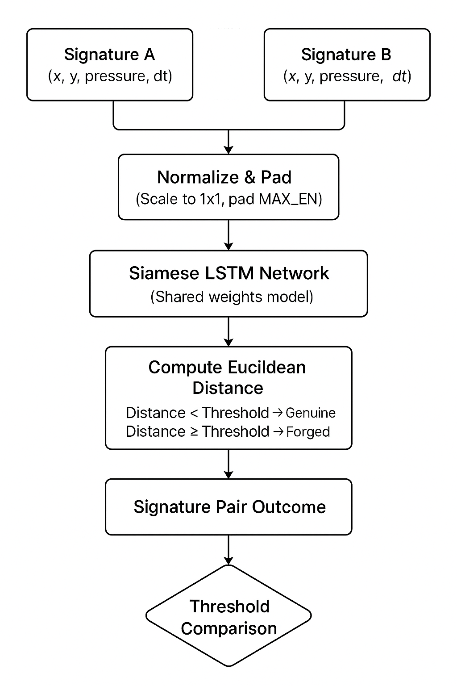

# **AI-Powered Signature Verification System ✒️**

This project implements a deep learning model to verify the authenticity of digital signatures. It uses a Siamese network with Bidirectional LSTM layers to analyze the dynamic properties of a signature—such as path, speed, and pressure—to distinguish between genuine and forged signatures. The project includes a complete workflow from synthetic data generation to model training, evaluation, and explainable AI (XAI) reporting.

## **✨ Key Features**

* **Siamese Network:** Utilizes a Siamese architecture with shared weights to learn a powerful similarity metric between two signatures.  
* **Dynamic Feature Analysis:** The model is trained on four key features: X-Y coordinates, pressure, and the time delta (dt) between points, allowing it to capture the unique rhythm and dynamics of a person's signature.  
* **Synthetic Data Generation:** Includes a robust script to generate a complex synthetic dataset, creating unique signature styles for multiple users and simulating natural variations.  
* **Explainable AI (XAI) Reports:** Generates a detailed 2x2 comparison report using **Occlusion Analysis** to visualize which parts of a signature were most critical to the model's decision, providing transparency and insight.  
* **End-to-End Workflow:** A complete Jupyter Notebook (404-FOUND_YI_HACKATHON_FINAL.ipynb) that covers the entire process from data creation to final prediction and analysis.

## **🚀 How It Works**

The project follows a standard machine learning pipeline broken down into several key steps:

### **1\. Data Generation and Preparation**

Since real signature data is private, we generate a synthetic dataset. The script creates unique "styles" for different users and then generates multiple signature samples for each. These are then paired into "genuine" (same user) and "forged" (different user) examples for training. All sequences are padded to a uniform length.

### **2\. Model Architecture**

The core of the project is a **Siamese network**.

* **Base Network:** A Bidirectional LSTM model acts as an encoder. It processes a single signature sequence and outputs a fixed-size numerical representation called an **embedding** (a "fingerprint").  
* **Comparison:** To compare two signatures, both are passed through the *same* base network. The model then calculates the **Euclidean distance** between the two resulting embeddings. A small distance indicates a high similarity.

### **3\. Training**

The model is trained using a **contrastive loss function**. This special loss function teaches the model to minimize the distance between embeddings of genuine signatures while maximizing the distance between embeddings of forged signatures.

### **4\. Prediction and Explainability**

After training, the model can predict the authenticity of any new signature pair.

* **Prediction:** The model outputs a distance score, which is compared against a decision **threshold** to classify the pair as "Genuine" or "Forged."  
* **XAI Report:** A detailed report is generated that includes:  
  * **Occlusion Analysis:** A heatmap on the signature path showing the most important regions.  
  * **Prediction Summary:** The final verdict and distance score.  
  * **Dynamic Statistics:** A quantitative comparison of the signatures' speed and pressure profiles.

## Workflow Diagram

<!--  -->

                +-----------------------------------+
                |      Signature Verification       |
                +-----------------+ +---------------+
                |  Signature A    | |  Signature B  |
                | (x, y, pressure,| | (x, y, pressure,|
                | dt)             | | dt)           |
                +-----------------+ +---------------+
                             |           |
                             v           v
                +-----------------------------------+
                |          Pre-processing           |
                |     (Normalize & Pad to MAX_LEN)  |
                +-----------------------------------+
                             |           |
                             v           v
                +-----------------------------------+
                |     Siamese LSTM Network          |
                |     (Shared Weights Model)        |
                +-----------------------------------+
                             |
                             v
                +-----------------------------------+
                |        Feature Comparison         |
                |  (Compute Euclidean Distance)     |
                +-----------------------------------+
                             |
                             v
                +-----------------------------------+
                |      Threshold Comparison         |
                |  Distance < Threshold  -> Genuine |
                |  Distance >= Threshold -> Forged  |
                +-----------------------------------+
                             |
                             v
                +-----------------------------------+
                |      Signature Pair Outcome       |
                |   (Genuine or Forged)             |
                +-----------------------------------+

---

## **🛠️ How to Use**

1. **Clone the repository:**  
   git clone https://github.com/aadityaagrawal/YG-Hackathon.git

2. **Install dependencies:**  
   pip install numpy tensorflow matplotlib scikit-learn

3. **Run the Notebook:** Open and run the YI\_HACKATHON\_FINAL (3).ipynb file in a Jupyter environment like Jupyter Lab or Google Colab. The notebook is self-contained and will:  
   * Generate the synthetic dataset.  
   * Define and compile the model.  
   * Train the Siamese network.  
   * Evaluate the model and display sample predictions.  
   * Generate a final, detailed XAI report comparing a genuine signature to a skilled forgery.
